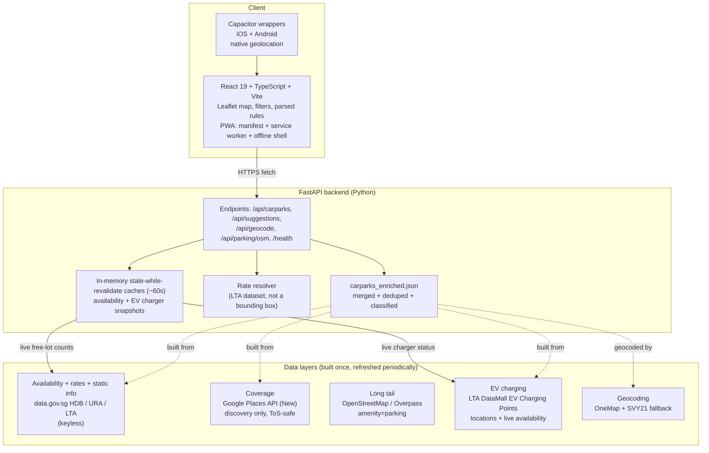

# EhParkLeh

EhParkLeh finds parking in Singapore. Enter a destination and it shows the carparks around it on a map, with live free-lot counts from the government feed, the real LTA rates rather than a guessed price, free-parking rules parsed into plain English, and filters by type (HDB, malls, street, private) and by EV charging. It installs as a PWA, keeps working offline against the last results, and wraps to iOS and Android through Capacitor.

Live at https://ehparkleh.vercel.app.

## Scope

EhParkLeh does one thing: finding a carpark. There is no payment, no booking, and no accounts. parking.sg (GovTech) covers payment but shows neither a map nor availability, so the two do not compete; EhParkLeh fills the finding gap.

Every finder reads the same free government availability feed, so live lot counts are a baseline, not a differentiator. What sets EhParkLeh apart, in order: a web-first PWA with no app-store download, type and EV filters, coverage past the government data, and a clear interface. It is built to be complete rather than a minimum viable product, so the rates are real, coverage extends beyond the government feed, the filters work, and it installs and runs offline.

## Features

- Live free-lot counts from data.gov.sg, cached about 60 seconds and refreshed
  in the background after expiry so an existing snapshot never blocks a search.
- Real LTA rates. Where a carpark has no dataset rate, the published HDB/URA standard schedule is applied, with the Central Area geofenced to the higher tier.
- Free-parking windows parsed into plain English.
- Filters by carpark type and by EV charging, the latter showing live "N free of M chargers" from LTA DataMall.
- A deliberate Near me action requests location only when you tap it; if access is denied, you can retry or search for a place instead.
- A no-match search stays neutral and suggests widening the radius or clearing active filters.
- Recent searches, saved favourites, and a shareable URL that reproduces a result on load.
- Installable PWA that falls back to the last results offline; iOS and Android wrappers through Capacitor.

## Architecture



The data layers are complementary:

| Layer | Source | Provides | Cost |
|---|---|---|---|
| Availability | data.gov.sg HDB/URA/LTA carpark-availability | Live free-lot counts | Free, keyless |
| Rates | data.gov.sg LTA Carpark Rates | Real rates, replacing the bounding-box hack | Free |
| Static info | HDB Carpark Information + URA Parking Lot GeoJSON | Locations, hours, type metadata | Free |
| Coverage | Google Places API (New) Nearby Search, type=parking | Every "P" location, including malls and private | Free tier |
| EV charging | LTA DataMall EV Charging Points (Batch) | Which carparks have chargers, plus live availability | Free, keyed |
| Long tail | OSM / Overpass amenity=parking | Free spots the gov and Google miss | Free |
| Indicative rates | LTA OneMotoring commercial-carpark guide | Rates for malls and private carparks absent from the datasets | Free |
| Curated rates | Hand-verified from mall operators' own sites | Heartland malls not in OneMotoring, sourced + dated | Free |
| Car wash | Beaver + QE Car Care published block lists | HDB carparks with a self-service wash | Free |

Google is used only to **discover** a location (name, coordinates, place_id). The persistent store and everything served to users comes from OpenStreetMap and government data. Availability and rates always come from the government layer; Google never provides them. This is the ToS-safe pattern.

## Data pipeline

The enrichment pipeline lives in `backend/enrich/` and produces a single `backend/carparks_enriched.json`. Each record carries a stable id, name, latitude and longitude (OneMap-corrected where possible), the contributing `sources`, a `category` for filtering, parsed `rates`, an `availability_key` linking to the live feed where one exists, a `free_parking` string, and EV fields where a charger sits nearby.

The build order is:

1. `fetch_gov.py` pulls the data.gov.sg HDB information, URA parking-lot GeoJSON, and LTA carpark rates into `gov_*.json`.
2. `crawl_google.py` runs a one-time grid crawl of Singapore for `type=parking` against the Places API. It respects a hard call cap (`GOOGLE_PLACES_MAX_CALLS`) so a bug cannot run up a bill.
3. `crawl_osm.py` queries Overpass for `amenity=parking` across Singapore.
4. `crawl_ev.py` pulls every EV charging point and its connectors from LTA DataMall (needs `LTA_DATAMALL_KEY`). `crawl_onemotoring.py` pulls LTA's OneMotoring rate guide for commercial carparks. `crawl_military.py`, `crawl_central_area.py`, and `crawl_sg_boundary.py` fetch the geofences used below.
5. `build_enriched.py` merges the sources onto the existing geocoded spine, dedupes by spatial proximity and name similarity, classifies each carpark, re-geocodes SVY21 fallback rows through OneMap (cached), attaches LTA and standard rates, then OneMotoring indicative rates by name for carparks a dataset rate misses, then a small hand-curated set (`manual_rates.json`, sourced from mall operator sites and dated) for heartland malls, flags carparks with EV charging within 75 m and HDB carparks with a self-service car wash (Beaver and QE Car Care's published block lists in `carwash_locations.json`, matched to a carpark by block and town since a block number is unique within a town; these two operators run the self-service machines in HDB multi-storey carparks), voids military areas, carparks outside Singapore (Johor pins near the Causeway), non-car-parking POIs (delivery and loading bays, bicycle and motorcycle parking, bus depots, drop-off points, heavy-vehicle and coach parks), business and private/restricted lots (valet firms, petrol stations, condos, staff-only), and a manual removal list, drops standalone OSM pins, and writes `carparks_enriched.json` and `STATS.md`.

Standalone OSM pins are dropped from the served dataset because they were the main source of construction-site and private junk; OSM still corroborates during dedup, and the live `/api/parking/osm` layer supplies OSM parking at search time. When configured, live EV availability is joined at request time from a stale-while-revalidate LTA DataMall snapshot, so the served dataset holds only the static EV flag.

Run the pipeline from `backend/` with the venv active:

```bash
python enrich/fetch_gov.py
python enrich/crawl_google.py   # needs GOOGLE_PLACES_API_KEY
python enrich/crawl_osm.py
python enrich/crawl_ev.py            # needs LTA_DATAMALL_KEY
python enrich/crawl_onemotoring.py  # LTA commercial-carpark rate guide
python enrich/build_enriched.py
```

See `backend/enrich/STATS.md` for the latest counts.

## Running locally

### Backend

```bash
cd backend
python3 -m venv venv
source venv/bin/activate
pip install -r requirements.txt
cp .env.example .env          # then fill in keys if running the Google or EV crawl
uvicorn main:app --reload --port 8000
```

The API serves on `http://localhost:8000`. `.env` holds the Google and LTA DataMall keys and tunables (call cap, availability TTL, log level); it is git-ignored. data.gov.sg and OneMap are keyless for the serving path.

`/api/carparks` reports `availability`, `ev`, `local_filter`, `total`, and
`process_uptime` metrics in the `Server-Timing` response header. Cache states
and refresh outcomes are also emitted as structured `key=value` application
logs, correlated by a non-secret per-process boot ID. A feed with an empty cache
waits for its first refresh attempt; the availability refresh and any configured
EV refresh start concurrently. After that, expired snapshots are served
immediately while one single-flight background refresh per feed updates the
cache. Refreshes share one connection-pooled HTTP client for the process
lifetime, and a failed refresh preserves the last good snapshot. Startup and
`/health` schedule (but never wait for) refreshes of empty or expired caches so
the existing keep-warm check also prepares a last-good snapshot for searches.
Response headers expose each feed's cache state and snapshot freshness deadline;
the frontend automatically downgrades expired, offline, or retained-after-error
values and does not service-worker-cache live search results.

Run the tests:

```bash
cd backend
source venv/bin/activate
python -m pytest
```

### Frontend

```bash
cd frontend
npm install
cp .env.example .env          # set VITE_API_BASE=http://localhost:8000 for the local backend
npm run dev
```

The dev server runs on `http://localhost:5173`. `VITE_API_BASE` selects the backend and falls back to the deployed Render URL when unset. Run `npm run test` for the Vitest suite and `npm run lint` for ESLint.

## Building the PWA

```bash
cd frontend
npm run build
npm run preview               # serve the production build to test install + offline
```

`vite-plugin-pwa` generates the web manifest and a Workbox service worker into `dist/`. Open the preview, install through the browser prompt, then go offline to confirm the cached shell and last results still load.

## Building the Capacitor apps

The native wrappers live in `frontend/android` and `frontend/ios` and share the Vite build. Geolocation uses the native `@capacitor/geolocation` plugin inside a wrapper and the browser API on the web.

```bash
cd frontend
npm run build
npx cap sync                  # copy dist/ into the native projects

npx cap open android          # Android Studio; Build > Build APK for a debug build
npx cap open ios              # Xcode; requires an Apple Developer account to sign and run on a device
```

## Deployment

The frontend deploys to Vercel and the backend to Render, both from `main`. `render.yaml` records the backend service configuration.

### Backend keep-warm

GitHub Actions runs [`.github/workflows/keep-warm.yml`](.github/workflows/keep-warm.yml) every five minutes (`*/5 * * * *`) and supports a safe manual run through **Run workflow**. It sends only a GET request to the public health endpoint, `https://ehparkleh-backend.onrender.com/health`, to reduce the observed first-request delay. The health handler returns without waiting on upstream feeds, but single-flights any needed background cache refresh. The request has connection and overall timeouts plus two retries, so a persistent failure remains visible in the workflow run. GitHub Actions schedules are best effort: runs can be delayed during periods of high load and may be disabled after 60 days without repository activity.

Run the production-readiness smoke check from the repository root:

```bash
./scripts/smoke-production.py --samples 5
```

It uses fixed public coordinates, records only counts and phase/cache/process
timings, and exits non-zero on an incompatible or unhealthy response. See
[`docs/production-readiness.md`](docs/production-readiness.md) for interpretation.

**Frontend (Vercel).** Root directory `frontend/`, framework preset Vite (build `npm run build`, output `dist`). `VITE_API_BASE` can point at the backend; it falls back to the Render URL when unset, so no env var is strictly required.

**Backend (Render).** Root directory `backend/`, start command `uvicorn main:app --host 0.0.0.0 --port $PORT`, build `pip install -r requirements.txt`. The served `carparks_enriched.json` is committed, so no build-time regeneration is needed; set the build command to `./build.sh` to rebuild the dataset on each deploy instead. Set `LTA_DATAMALL_KEY` in the environment for live EV charger counts. CORS allows the production frontend origin plus anything listed in `ALLOWED_ORIGINS`.

## Project layout

```
backend/                  FastAPI app
  main.py                 endpoints, TTL caches, rate resolver, filters
  carparks_enriched.json  merged + deduped + classified dataset (served)
  enrich/                 data pipeline (fetch, crawl, merge, classify)
  tests/                  pytest suite
frontend/                 React 19 + TypeScript + Vite
  src/                    App.tsx, Map.tsx, geo.ts, rules.ts, types.ts, hooks, tests
  android/  ios/          Capacitor native projects
.github/workflows/ci.yml  lint, typecheck, test, build on push and PR
render.yaml               backend service configuration
V2_PLAN.md                the v2 build spec
V2_BUILD_REPORT.md        what the v2 build delivered and what is outstanding
```

## Stack

React 19, TypeScript, Vite, Leaflet, vite-plugin-pwa, Capacitor, and Vitest on the front; FastAPI, Pydantic, and httpx on the back. Data from data.gov.sg, OpenStreetMap, the Google Places API, LTA DataMall, LTA OneMotoring, and OneMap.
</content>
</invoke>
