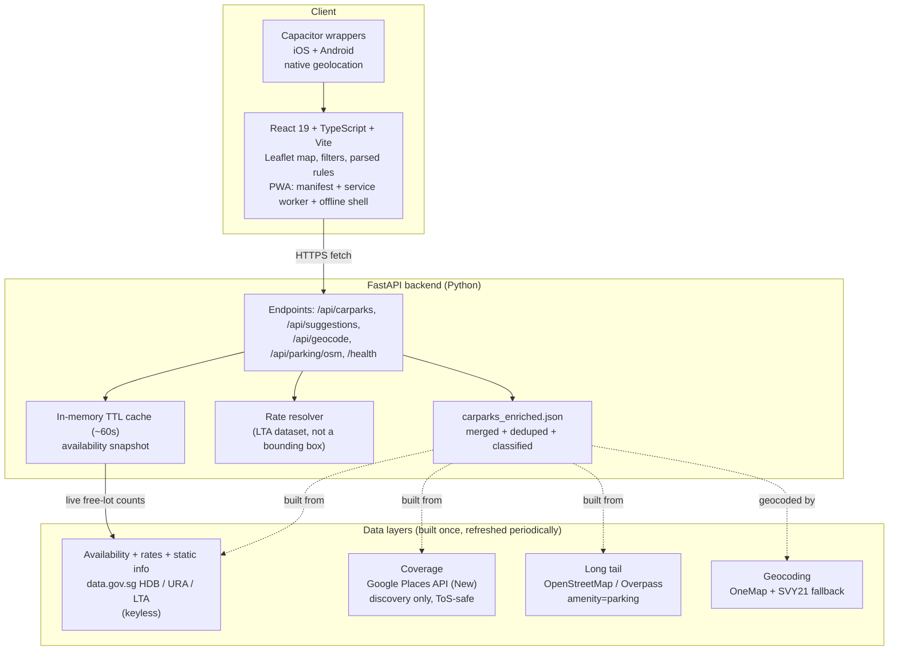

# EhParkLeh

A Singapore parking finder. One job, done completely: **"where do I park near here, right now, that fits my needs."**

EhParkLeh answers that question on a fast map. It shows live free-lot counts from the government feed, real LTA rates instead of a guessed price, parsed free-parking rules in plain English, and type filters (HDB, malls, street, private). It installs as a PWA, works offline against the last results, and wraps to iOS and Android via Capacitor.

## Positioning

This is built as an SLC product (Simple, Lovable, Complete), not an MVP.

- **Simple.** Finding parking only. No payment, no booking, no accounts. parking.sg already owns payment; EhParkLeh owns finding.
- **Lovable.** A distinctive redesign, a smooth map, rules parsed into plain English, clear availability visuals. The incumbents are utilitarian; this is the high-leverage win.
- **Complete.** Real rates, broad coverage (gov plus OSM), working type filters, installable, wrappable to native, offline-capable.

parking.sg (GovTech) is a payment app with no map or availability, so it is not a competitor; EhParkLeh fills the gap it leaves. The finder space shares one free government feed, so "shows live lots" is table stakes. The defensible edges, in order, are: a web-first PWA with no download wall, smart type filters, coverage beyond the gov data, and a lovable interface.

## Architecture



The three data layers are complementary, and that complementarity is the point:

| Layer | Source | Provides | Cost |
|---|---|---|---|
| Availability | data.gov.sg HDB/URA/LTA carpark-availability | Live free-lot counts | Free, keyless |
| Rates | data.gov.sg LTA Carpark Rates | Real rates, replacing the bounding-box hack | Free |
| Static info | HDB Carpark Information + URA Parking Lot GeoJSON | Locations, hours, type metadata | Free |
| Coverage | Google Places API (New) Nearby Search, type=parking | Every "P" location including malls and private | Free tier |
| Long tail | OSM / Overpass amenity=parking | Free spots gov and Google miss | Free |

Google is used only to **discover** a location (name, coordinates, place_id). The persistent store and everything served to users is OSM plus government data. Availability and rates always come from the gov layer; Google never provides those. This is the ToS-safe pattern.

## Data pipeline

The enrichment pipeline lives in `backend/enrich/` and produces a single `backend/carparks_enriched.json`. Each record carries a stable id, name, latitude and longitude (OneMap-corrected where possible), the contributing `sources`, a `category` for filtering, parsed `rates`, an `availability_key` linking to the live feed where one exists, and a `free_parking` string.

The build order is:

1. `fetch_gov.py` pulls the data.gov.sg HDB information, URA parking-lot GeoJSON, and LTA carpark rates into `gov_*.json`.
2. `crawl_google.py` runs a one-time grid crawl of Singapore for `type=parking` against the Places API. It respects a hard call cap (`GOOGLE_PLACES_MAX_CALLS`) so a bug cannot run up a bill.
3. `crawl_osm.py` queries Overpass for `amenity=parking` across Singapore.
4. `build_enriched.py` merges all sources onto the existing geocoded spine, dedupes by spatial proximity and name similarity, classifies each carpark into a category, re-geocodes SVY21 fallback rows through OneMap (cached), attaches LTA rates, and writes `carparks_enriched.json`. It also writes `STATS.md`.

Run the whole pipeline from `backend/` with the venv active:

```bash
python enrich/fetch_gov.py
python enrich/crawl_google.py   # needs GOOGLE_PLACES_API_KEY
python enrich/crawl_osm.py
python enrich/build_enriched.py
```

See `backend/enrich/STATS.md` for the latest counts.

## Running locally

### Backend

```bash
cd backend
python3 -m venv venv
source venv/bin/activate
pip install -r requirements.txt
cp .env.example .env          # then fill in keys if running the Google crawl
uvicorn main:app --reload --port 8000
```

The API serves on `http://localhost:8000`. `.env` holds the Google key and tunables (call cap, availability TTL, log level); it is git-ignored. data.gov.sg and OneMap are keyless for the serving path.

Run the tests:

```bash
cd backend
source venv/bin/activate
python -m pytest
```

### Frontend

```bash
cd frontend
npm install
cp .env.example .env          # set VITE_API_BASE=http://localhost:8000 for local backend
npm run dev
```

The dev server runs on `http://localhost:5173`. `VITE_API_BASE` selects the backend; it falls back to the deployed Render URL if unset.

## Building the PWA

```bash
cd frontend
npm run build
npm run preview               # serve the production build to test install + offline
```

`vite-plugin-pwa` generates the web manifest and a Workbox service worker into `dist/`. Open the preview, install via the browser prompt, then go offline to confirm the cached shell and last results still load.

## Building the Capacitor apps

The native wrappers live in `frontend/android` and `frontend/ios`, sharing the Vite build. Geolocation uses the native `@capacitor/geolocation` plugin when running inside a wrapper and the browser API on the web.

```bash
cd frontend
npm run build
npx cap sync                  # copy dist/ into the native projects

npx cap open android          # opens Android Studio; Build > Build APK for a debug build
npx cap open ios              # opens Xcode; requires an Apple Developer account to sign and run on a device
```

## Project layout

```
backend/                FastAPI app
  main.py               endpoints, TTL cache, rate resolver, category filters
  carparks_enriched.json  merged + deduped + classified dataset (served)
  enrich/               data pipeline (fetch, crawl, merge, classify)
  tests/                pytest suite
frontend/               React 19 + TypeScript + Vite
  src/                  App.tsx, Map.tsx, geo.ts, rules.ts, types.ts
  android/  ios/         Capacitor native projects
V2_PLAN.md              the v2 build spec
V2_BUILD_REPORT.md      what the v2 build delivered and what is outstanding
```

## Stack

React 19, TypeScript, Vite, Leaflet, vite-plugin-pwa, Capacitor on the front; FastAPI, Pydantic, httpx on the back. Data from data.gov.sg, OpenStreetMap, the Google Places API, and OneMap.
